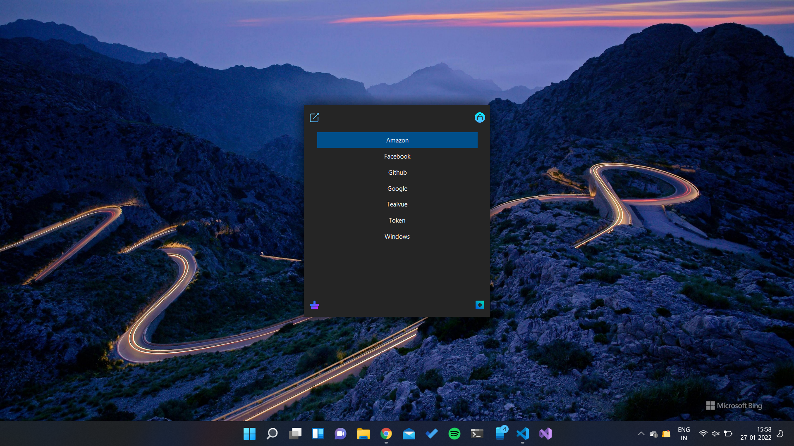

<!--
 Copyright (c) 2021 Sri Lakshmi Kanthan P
 
 This software is released under the MIT License.
 https://opensource.org/licenses/MIT
-->

<!-- PROJECT LOGO -->
 

  

  <h3 align="center">Facsimile</h3>

  

    An exact copy of Your Information !
     
    <a href="https://github.com/srilakshmikanthanp/facsimile/issues">Report Bug</a>
    ·
    <a href="https://github.com/srilakshmikanthanp/facsimile/issues">Request Feature</a>
  

<!-- TABLE OF CONTENTS -->

  
<h2 style="display: inline-block">Table of Contents</h2>

  <ol>
    <li>
      <a href="#about-the-project">About The Project</a>
      <ul>
        <li><a href="#built-with">Built With</a></li>
      </ul>
    </li>
    <li>
      <a href="#getting-started">Getting Started</a>
      <ul>
        <li><a href="#installation">Installation</a></li>
      </ul>
    </li>
    <li><a href="#demo">Demo</a></li>
    <li><a href="#security">Security</a></li>
    <li><a href="#roadmap">Roadmap</a></li>
    <li><a href="#contributing">Contributing</a></li>
    <li><a href="#license">License</a></li>
    <li><a href="#thanks">Thanks</a></li>
    <li><a href="#contact">Contact</a></li>
  </ol>

<!-- ABOUT THE PROJECT -->
## About The Project

Copy Your Most Used Text to Clipboard Easily with Facsimile!. It Helps You to Store You Most Used Text as a Key, Value Pair and Copy it to Clipboard with a Shortcut.

### Built With

* javafx
* swing
* awt

<!-- GETTING STARTED -->
## Getting Started

To install Facsimile, follow the instructions below.

### Installation

Follow the instructions below to install Facsimile on different platforms.

#### For Windows

  1. Download the latest version of Facsimile from [Releses](https://github.com/srilakshmikanthanp/Facsimile/releases).
  2. Double click on the downloaded file to install Facsimile.
  3. After installation, Add it to system [startup](https://support.microsoft.com/en-us/windows/add-an-app-to-run-automatically-at-startup-in-windows-10-150da165-dcd9-7230-517b-cf3c295d89dd).

<!-- USAGE EXAMPLES -->
## Demo

## Security

</img>

Facsimile Stores your Info as Encrypted means even you can't access your Info without your password !

<!-- ROADMAP -->
## Roadmap

See the [open issues](https://github.com/srilakshmikanthanp/facsimile/issues) for a list of proposed features (and known issues).

<!-- CONTRIBUTING -->
## Contributing

Contributions are what make the open source community such an amazing place to learn, inspire, and create. Any contributions you make are **greatly appreciated**.

1. Fork the Project
2. Create your Feature Branch (`git checkout -b feature/AmazingFeature`)
3. Commit your Changes (`git commit -m 'Add some AmazingFeature'`)
4. Push to the Branch (`git push origin feature/AmazingFeature`)
5. Open a Pull Request

<!-- LICENSE -->
## License

Distributed under the MIT License. See `LICENSE` for more information.

## Thanks

Thanks to [FlatIco](https://www.flaticon.com/)

<!-- CONTACT -->
## Contact

Project Link: [https://github.com/srilakshmikanthanp/facsimile](https://github.com/srilakshmikanthanp/facsimile)
